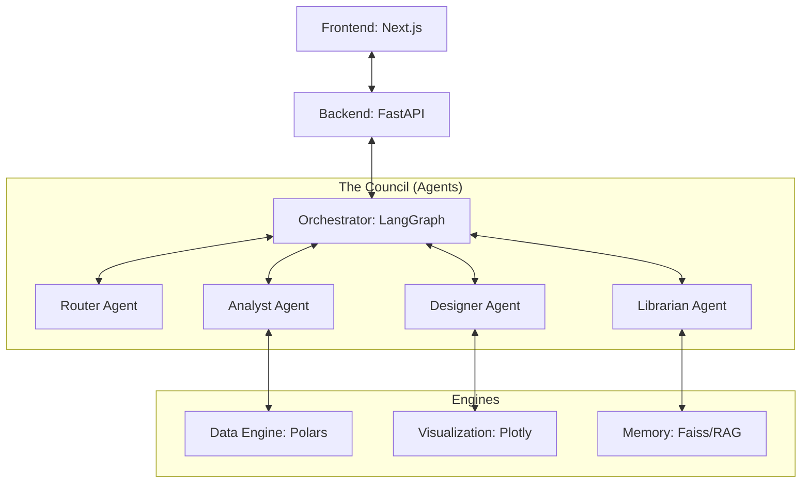

# The Council 2.0

The Council 2.0 is an autonomous data analysis system combining multi-agent semantic orchestration with deterministic high-performance data processing. Designed as a modular, white-label solution, it seamlessly integrates multi-LLM support, RAG, and advanced visual insights.

## 🏗 Project Architecture



## 📂 Project Structure

- **[backend/](file:///e:/The_Council_v2/backend)**: Python-based core featuring LangGraph agents, Polars data processing, and Faiss-powered RAG.
- **[frontend/](file:///e:/The_Council_v2/frontend)**: Next.js application with a "Dark-Data" glassmorphism UI for interactive analysis and reporting.

## 🚀 Getting Started

### Prerequisites

- [uv](https://github.com/astral-sh/uv) (for backend dependency management)
- [Node.js & npm](https://nodejs.org/) (for frontend)
- [Ollama](https://ollama.ai/) (for local LLM execution)

### Quick Setup

1. **Initialize Backend**:
   ```bash
   cd backend
   uv sync
   uv run main.py
   ```

2. **Initialize Frontend**:
   ```bash
   cd frontend
   npm install
   npm run dev
   ```

3. **Configure Ollama**:
   Ensure `ollama` is running and pull the required model:
   ```bash
   ollama pull qwen2.5-coder:1.5b
   ```

## 📖 Deep Documentation

- [Technical Architecture](file:///e:/The_Council_v2/ARCHITECTURE.md)
- [Backend Usage Guide](file:///e:/The_Council_v2/backend/USAGE_GUIDE.md)
- [Code Index](file:///e:/The_Council_v2/docs/code_index.md)

---
*The Council 2.0: From Data to Wisdom, Deterministically.*
